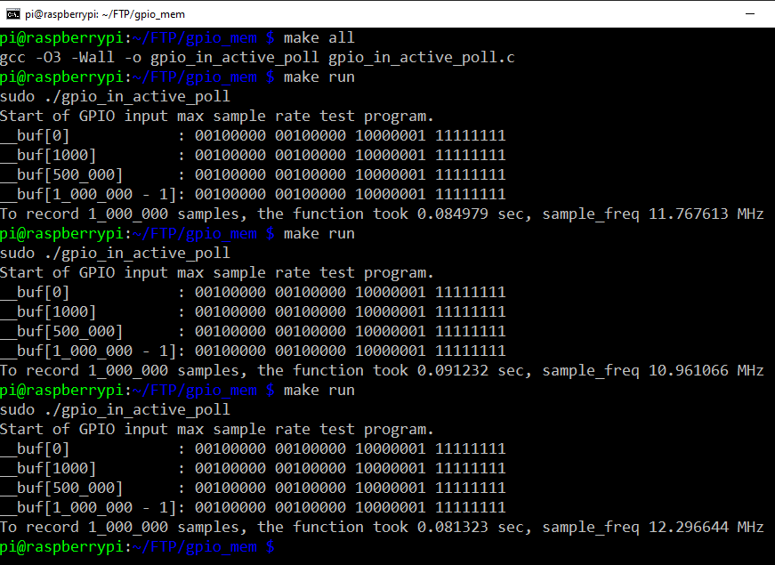

# Max GPIO input to memory speed of Raspberry Pi
A simple source code to test it. 

## Description
I wanted to test the max reading sample frequency from the input registers of the GPIO in Raspberry PI 3 and 4 (currently I only have the 3 B). This is using active pooling on the register and timing it. <br>
And I was reading the wonderful book by Derek Molloy on Raspberry Pi called Exploring Raspberry Pi: Interfacing to the Real World with Embedded Linux 1th Edition, when I came to the chapter 6 Interfacing to the Raspberry Pi input/ Outputs, section Memory based GPIO Control at pages ranging from 245 to 252. And sow the source code listing 6-9: /chp06/memoryGPIO/LEDFlash.c . This program is used to demonstrate how to flash a led by controlling the directly the physical memory mapped registers. <br>
The original file can be found on the authors github account in [github derekmolloy / exploringrpi/chp06/memoryGPIO/](https://github.com/derekmolloy/exploringrpi/tree/master/chp06/memoryGPIO).    

## To configure to your specific RPI version uncomment the correct version.

```C

// Remember that in the RPI there is BUS memory, physical memory
// and Virtual memory addressing spaces.
// Location of peripheral registers in physical memory.
//#define GPIO_BASE  (0x20000000 + 0x200000)  /* Pi Zero or 1 */
#define GPIO_BASE    (0x3F000000 + 0x200000)  /* Pi 2 or 3    */
//#define GPIO_BASE  (0xFE000000 + 0x200000)  /* Pi 4         */

```

## Output image of the max average input frequency results on a Raspberry Pi 3 B V1.2

The GPIO pin 21 is configured in the code as input (high impedance) and is connected with a jumper cable to 3.3V. <br>
The differences in Max average frequency from different runs arise from the fact that the access is concurrent with other tasks of the Operating System, and there is contention because of that in the CPU chip BUS. The fact that interrupt are also enable also contributes to the fact that there is no real determinism in it. Don't forget that Linux isn't a realtime operating system and you always have the scheduler. <br>
But this gives a good indicative result. <br>
<br> 



## References
* [Derek Molloy Book authors site](http://exploringrpi.com/)
* [Derek Molloy Book authors github](https://github.com/derekmolloy/exploringrpi.git)
* [Broadcom BCM2835 ARM Peripherals](https://www.raspberrypi.org/app/uploads/2012/02/BCM2835-ARM-Peripherals.pdf)
* [Broadcom BCM2835 datasheet errata](https://elinux.org/BCM2835_datasheet_errata)
* [Raspberry Pi DMA programming in C](https://iosoft.blog/2020/05/25/raspberry-pi-dma-programming/)

## License
This is a derived work from the books example so it retains all the GNU General Public License of the original work.
@book{978-1-119-1868-1, Author = {Derek Molloy}, Title = {Exploring Raspberry Pi: Interfacing to the Real World with Embedded Linux}, Publisher = {Wiley}, Year = {2016}, ISBN = {978-1-119-1868-1}, URL = {http://www.exploringrpi.com/} }

## Have fun!
Best regards, <br>
Joao Nuno Carvalho <br>
